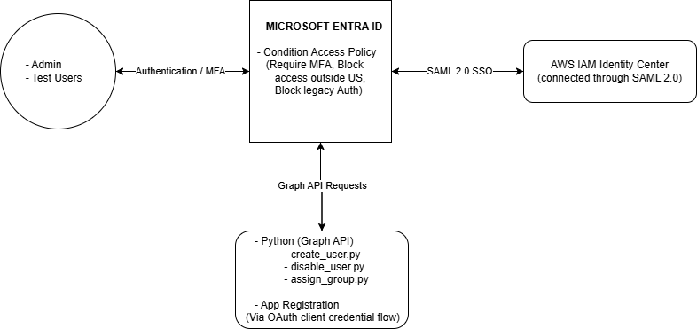

# Entra ID Zero Trust IAM Lab

## Overview
This project is an Identity and Access Management lab built 
using Microsoft Entra ID, Microsoft Graph API, and Python. This project uses
enterprise Zero Trust environment by enforcing MFA, blocking legacy 
authentication, restricting access by location, and automating user 
lifecycle management through the Graph API.

## Architecture Diagram

## Technologies Used
- Microsoft Entra ID
- Microsoft Graph API
- Python 3
- SAML 2.0 / OIDC
- AWS IAM Identity Center
- OAuth 2.0 Client Credentials Flow
- Microsoft 365 Developer Tenant
- python-dotenv
- requests library

## Project Phases

### Part 1 — Tenant Setup & User Management
Provisioned a Microsoft 365 Developer tenant and configured Microsoft 
Entra ID as the identity platform. Created test users with assigned roles 
and permissions including a Helpdesk Administrator.

### Part 2 — Conditional Access & Zero Trust
Built three Conditional Access policies enforcing Zero Trust principles:
- Require MFA for all users
- Block access from outside the United States
- Block legacy authentication protocols

### Part 3 — SSO App Integration
Configured SAML 2.0 Single Sign-On federation between Microsoft Entra ID 
and AWS IAM Identity Center. Users authenticate through Entra ID with MFA 
enforced before accessing the AWS access portal.

### Part 4 — Graph API Automation with Python
Wrote three Python scripts using Microsoft Graph API to automate identity 
lifecycle management:
- create_user.py — provisions a new user in Entra ID
- disable_user.py — disables a user account for offboarding
- assign_group.py — assigns a user to a group

  Authentication uses OAuth 2.0 Client Credentials Flow via an App 
  Registration with User.ReadWrite.All and GroupMember.ReadWrite.All 
  permissions.

### Part 5 — Documentation & Architecture Diagram
Created an architecture diagram showing the full identity flow across all 
components. Documented the project with screenshots and README.

## How to Run the Python Scripts

1. Clone the repository:
git clone https://github.com/yourusernameTheLazyLearnerIII/entra-id-iam-lab.git

2. Create a `.env` file in the project root with your credentials:

CLIENT_ID=your-application-client-id
CLIENT_SECRET=your-client-secret-value
TENANT_ID=your-directory-tenant-id

3. Install dependencies:
pip install requests python-dotenv

4. Run a script:
python create_user.py
python disable_user.py
python assign_group.py

## Key Concepts Demonstrated
- Zero Trust identity enforcement
- Conditional Access policy design
- SAML 2.0 SSO federation
- OAuth 2.0 Client Credentials Flow
- Microsoft Graph API automation
- User lifecycle management (provisioning, offboarding, group assignment)
- Least privilege permissions (Admin Consent)
- Cross-cloud identity federation (Entra ID + AWS)
- Bearer token authentication
- Secure credential management with .env and .gitignore

## Screenshots
All screenshots organized by phase in the `/docs` folder:
- `/docs/phase1/` — Tenant setup and user creation
- `/docs/phase2/` — Conditional Access policies
- `/docs/phase3/` — SSO configuration and AWS access portal
- `/docs/phase4/` — Python automation results